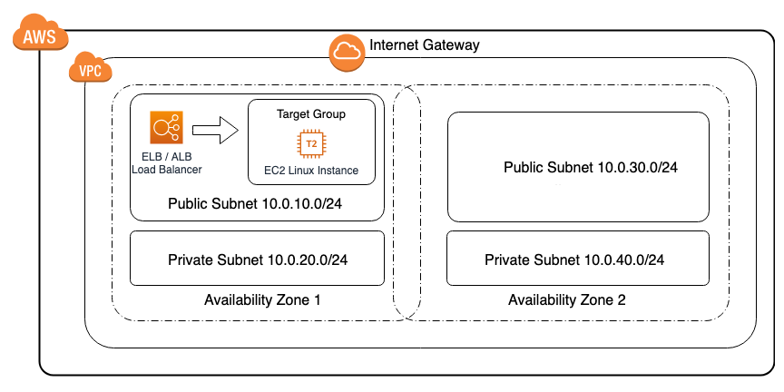

# aws-elb-to-ec2-target-group

## Description:

This <a href="https://aws.amazon.com/cloudformation/" target="_blank">AWS CloudFormation</a> solution deploys an <a href="https://aws.amazon.com/vpc/" target="_blank">AWS VPC</a> environment that has 2 public zones and 2 private zones with an <a href="https://docs.aws.amazon.com/elasticloadbalancing/latest/application/load-balancer-target-groups.html" target="_blank">EC2 Target Group</a> that has one <a href="https://aws.amazon.com/ec2/" target="_blank">EC2</a> linux instance in it and a <a href="https://aws.amazon.com/elasticloadbalancing/" target="_blank">AWS ELB (ALB)</a> load balancer routing traffic to it.

